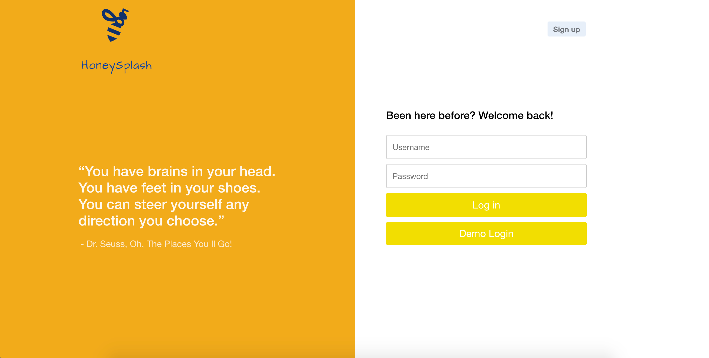

# Honey Splash
[Honey Splash](https://honey-splash.herokuapp.com) is a single-page web application designed to help users organize and manage their tasks.



## Technologies
* React
* Redux
* Ruby on Rails
* JavaScript
* PostgreSQL
* HTML
* CSS
* Webpack

## Features
### Lists
Users can create lists, using which they can organize their tasks.


### Task Selection and Toggling Edit Form


One of the most subtle yet important details of this application is how selecting tasks and toggling the task edit form are related to each other.  The task edit form is toggled by clicking on the task title whereas tasks are selected and deselected by clicking on the checkbox. When a task edit form is opened, the corresponding task is concurrently selected.  If users do not want this task to be selected, they can simply deselect it with a click on the checkbox, and the task edit form will not go away.  Even with the task edit form open, users can proceed to continue selecting other tasks.  When the title of a a different task is clicked, the previously opened task edit form will be closed and its corresponding task will be deselected simultaneously while the new task edit form is opened.


```javascript
  toggleSelectTask(e, selectedTask, toggleForm) {
    e.preventDefault();

    if (this.state.selected && !this.state.openEditForm) {
      // Deselect task if only toggling task selection
      if (!toggleForm) {
        this.setState({
          selected: false
        })
        this.props.deselectTask(selectedTask);
      }
      // Don't change task selection if toggling task edit form
    } else if (this.state.selected) {
      this.setState({
        selected: false
      })
      this.props.deselectTask(selectedTask);
      // Not selected
    } else { 
      this.setState({
        selected: true
      })
      this.props.selectTask(selectedTask);
    }
  }
```

```javascript
  toggleSelectAndEditTask(e, selectedTask) {
    e.preventDefault();
    this.toggleSelectTask(e, selectedTask, true);
    this.props.setCurrentTaskForm(this.props.task);
    if (this.state.openEditForm) {
      this.setState({
        selected: true,
        openEditForm: false
      })
      this.props.history.push(`/lists/${this.props.currentListId}`);
    } else {

      this.setState({
        openEditForm: true
      })

      this.props.history.push(`/lists/${this.props.currentListId}/tasks/${this.props.task.id}`);
    }
  }
```
